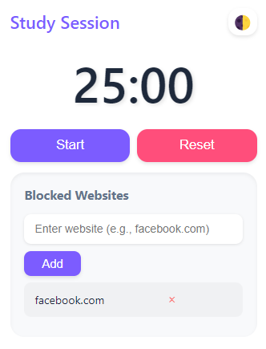
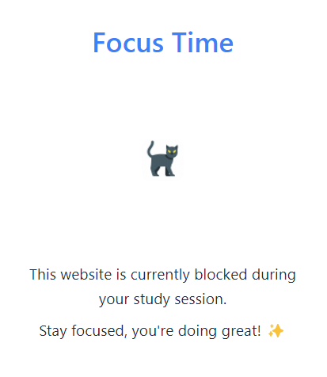

# Study Session Extension

A Chrome extension for focused study sessions with website blocking and Pomodoro timer.

## Preview

### Extension Popup
#### Light Theme

#### Dark Theme

### Blocked Page
#### Light Theme

#### Dark Theme

## Technical Details

- Built with vanilla JavaScript
- Uses Chrome Extension Manifest V3
- Implements Chrome Storage API for persistence
- Uses Chrome WebNavigation API for website blocking

## Credits

- Icon Attribution: <a href="https://www.flaticon.com/free-icons/cat" title="cat icons">Cat icons created by Freepik - Flaticon</a>

## Features in Detail

### Timer
- 25-minute Pomodoro timer
- Continues running when popup is closed
- Visual feedback for active sessions

### Website Blocking
- Add/remove websites from block list
- Automatic blocking during active sessions
- Persists between browser sessions

### Theme Toggle
- Light/Dark mode support
- Persistent theme preference
- Smooth theme transitions

## Development

The extension is built using:
- HTML5
- CSS3
- Vanilla JavaScript
- Chrome Extension APIs

## Future Improvements

Potential features for future versions:
1. Customizable timer duration
2. Sound notifications
3. Session statistics
4. Multiple timer modes
5. Custom block lists

## License

This project is open source and available under the MIT License.

## Contributing

Feel free to fork this project and submit pull requests for any improvements.

1. Fork the Project
2. Create your Feature Branch (`git checkout -b feature/AmazingFeature`)
3. Commit your Changes (`git commit -m 'Add some AmazingFeature'`)
4. Push to the Branch (`git push origin feature/AmazingFeature`)
5. Open a Pull Request 

## Security Notes

- The extension only requires minimal permissions
- All data is stored locally on your device
- No data is sent to external servers
- Website blocking is done locally
- Input validation is implemented for all user inputs
- The extension follows Chrome's security best practices

## Privacy

- No user data is collected
- No analytics or tracking
- All blocked website data stays on your device
- Theme preferences are stored locally 

## Installation

1. Clone this repository or download the ZIP file
2. Open Chrome and navigate to `chrome://extensions/`
3. Enable "Developer mode" in the top right
4. Click "Load unpacked" and select the extension directory

## Quick Start

1. Click the extension icon in your browser
2. Set your blocked websites
3. Start a 25-minute study session
4. The extension will block distracting sites until the timer ends 